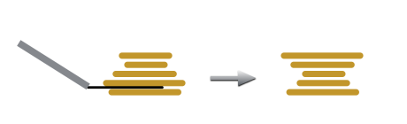
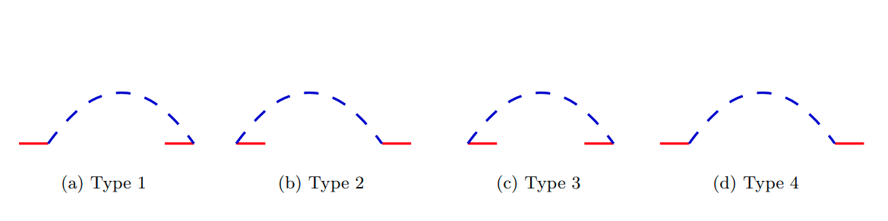

# Pancake Sorting

_Pancake Sorting is scientifically known as Sorting by Prefix Reversal, but we will call it Pancake Sorting to give a meaning that has some curious implication in real life._

Let&#39;s imagine we have a stack of ___N___ pancakes, one on top of another, and they all have different sizes, for the purpose of the exercise, we will assign an integer value to represent the size of each pancake.

Now let&#39;s picture a spatula, we can insert this spatula between two pancakes at any point of our stack, and flip all the pancakes that are on top of the spatula.

<p align="center">
  
</p>

A _pancake number_ is the minimum number of flips needed to sort a given number of pancakes, where a stack of sorted pancakes has the biggest pancake at the bottom of the stack, and every pancake above the bottom one is smaller than the pancake below.

It has been proved that for any stack of ___N___ pancakes, the minimum number of flips required to sort it lies between ___1.0714N___[[1]](#1) and ___1.6364 N___[[2]](#2) flips, but there is not an exact formula yet.


## Flip
We will consider the following function:
> Flip(___X___): Takes the first ___X___ pancakes in the pile, and flips them, reversing their order.

## Representation of the pancake pile

There are numerous ways to represent this problem on a computer, including graphs, permutations, strings and lists. For this project we will use 3 different approaches to represent the order of the pancake pile:
1. A graph, where each node is a possible permutation, and there exists an edge between two nodes if there is a Flip that converts one node into the other.
2. A list of size ___N___, where each position of the list represents the size of that pancake in that position. The first element of this list is the top of the pancakes pile.
3. The same list mentioned above with some extra characteristics:
    - We will also consider two imaginary pancakes with values: ___0___ and ___N+1___
    - If two adjacent pancakes don't have adjacent values, we consider there is a red edge connecting them.
    - If two pancakes have adjacent values, but are not adjacent in the list, we consider there is a blue edge connecting them.

## Algorithms used

### Exhaustive search
Of course this approach has to be considered, in order to compare the efficiency of our other algorithms for small cases.<br>
We will use the first representation mentioned above. <br>
We will run a BFS from the node where the list is sorted, and calculate all distances to every possible permutation.<br>
Finally we will have the minimal number of flips it takes to get from the sorted pancake pile, to any other permutation, and vice versa, which is exactly what we wanted. 

This method will guarantee we get an optimal result, the only problem is that it has a big time complexity, ___O(N!)___ and the space complexity is ___O(N*N!)___

### 3-Approximation

For this Algorithm we will use the second representation mentioned.

1. Pick the biggest pancake not sorted yet, with position equal to ___X___.
2. Flip(___X___)
3. Now that the biggest pancake not sorted yet is on top, let's take ___X___ as the value of the pancake on the top.
4. Flip(___X___)
5. Repeat step 1 until all the pancakes are sorted.

We can prove that in the worst case, this method will take at most ___2N - 2___ flips for ___N >= 2___.

### 2-Approximation

And for the best approximation algorithm we will consider(and also the best existing[[3]](#3)), we will use the third representation mentioned.

We start by noticing that each red edge in our initial representation will take at most 2 Flips to disappear. (This is why it's called a 2-Approximation)<br>
A representation with no red edges, is already sorted.

In order to eliminate one red edge we will consider the next 4 possible situations in our representation. For every blue edge, one of these 4 possible scenarios must be given.
<p align="center">
  
</p>

These situations are given between two pancakes ___i___ and ___j___, where ___i < j___
If we have the following scenarios, we can get rid of one red edge.
- Blue edge of Type 1, with ___i = 1___ 
> Flip ___(j-1)___
- Blue edge of Type 2, where ___i != 0___ and ___j != N + 1___ 
> Flip ___(j)___ <br> Flip ___(j-i)___
- Blue edge of Type 3
> Flip ___(i)___<br>Flip ___(j - 1)___

Once we are finished with this process, we will have:
- One blue edge of type 2, with ___i = 0___
- One blue edge of type 1, with ___i != 0___
- Other blue edges of type 4

And also, our list will have the following form:<br>
___p1, p1 - 1, ... , 1, p2, p2 - 1, ... , p1 + 1, ... , N, ..., pk + 1___<br>
Where ___k___ is the number of red edges remaining minus 1. <br>
This is a simple situation to solve in exactly ___2k___ steps.
> Flip ___(N)___<br>Flip ___(N - p1)___<br>Flip ___(N)___<br>Flip ___(N - (p2 - p1))___<br>...<br>Flip ___(N)___<br>Flip ___(N - (N - p_k))___

And the pancake pile will be finally sorted.

## Proof Pancake sorting is NP-Hard
Pancake sort can be reduced from the NP-Hard problem 3-SAT, which implies that Pancake Sorting is also NP-Hard[[4]](#4).

## Practical Applications
There are some interesting practical purposes for this problem - in comparative genomics, or parallel processor networks, in which it can provide an effective routing algorithm between processors.

> But who needs practical uses of Sorting by Prefix Reversal when we can simply be hungry for sorted pancakes?


<p align="center">
  
</p>

## Requirements
- CMake 3.20 or higher
- Python3 with tkinter installed _(Only if you want to use the GUI)_

## Using the GUI
Go to the root directory of the project, open a Terminal and run the following command:
```
python3 GUIApp.py
```

## Build the project manually and run with C++ (No GUI)
Once you have cloned or downloaded the project and extracted it.<br>
Go to the root directory of the project, open the Terminal and run the following commands:

```
mkdir build
cd build
cmake ..
make
```

### Execute the user-directed program on C++
In order to execute the program, execute the following command from the Terminal, from the "build" directory
```
./Run
```

## References


<a id="1">[1]</a> 
William H.Gates, Christos H.Papadimitriou:
[Bounds for sorting by prefix reversal.](https://www.sciencedirect.com/science/article/pii/0012365X79900682?via%3Dihub)<br>

<a id="2">[2]</a> 
B.Chitturi, W.Fahle, Z.Meng, L.Morales, C.O.Shields, I.H.Sudborough, W.Voit:
[An ___18/11___ upper bound for sorting by prefix reversals.](https://www.sciencedirect.com/science/article/pii/S0304397508003575?via%3Dihub)<br>

<a id="3">[3]</a> 
Johannes Fischer and Simon W. Ginzinger:
[A 2-Approximation Algorithm for Sorting by Prefix Reversals.](https://citeseerx.ist.psu.edu/viewdoc/download?doi=10.1.1.68.9174&rep=rep1&type=pdf)<br>
[_Algorithms - ESA 2005_](https://link.springer.com/content/pdf/10.1007/11561071.pdf): 415-425, 2005

<a id="4">[4]</a> 
Laurent Bulteau, Guillaume Fertin, Irena Rusu:
[Pancake Flipping is Hard](https://arxiv.org/abs/1111.0434)<br>
